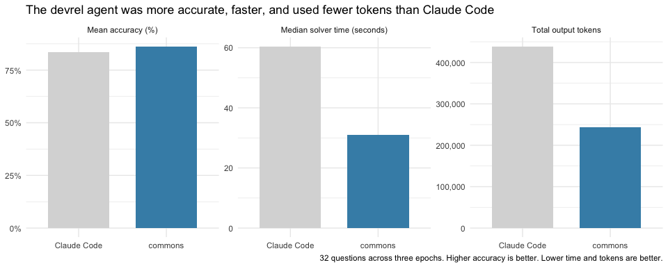

<!-- README.md is generated from README.Rmd. Please edit that file -->

# devrel agent

A [commons agent](https://github.com/posit-dev/commons) for exploring
the adoption, engagement, and growth of Posit open-source projects.

The agent is more accurate, faster, and cheaper on devrel-related
questions than Claude Code placed in the devrel-io repository.

The agent analyzes the
[devrel-io](https://github.com/posit-dev/devrel-io) data, which is an
automated collection of devrel metrics. devrel-io is built with
[posit-dev/velocirepo](https://github.com/posit-dev/velocirepo), a more
general data synthesis software.
